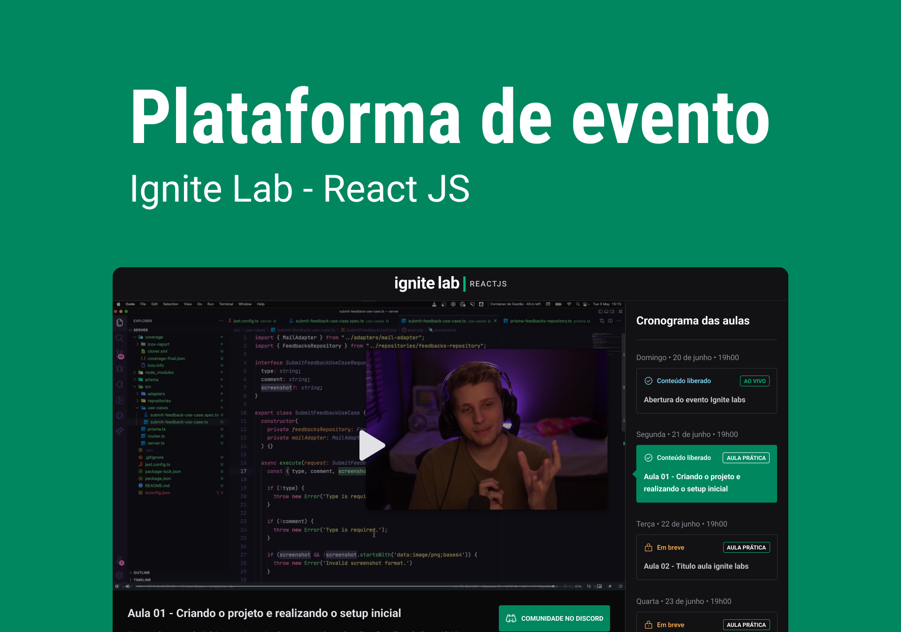

# Ignite Lab 🚀

  <a href="#-technologies">Technologies</a>&nbsp;&nbsp;&nbsp;|&nbsp;&nbsp;&nbsp;
  <a href="#-project">Project</a>&nbsp;&nbsp;&nbsp;|&nbsp;&nbsp;&nbsp;
  <a href="#-layout">Layout</a>&nbsp;&nbsp;&nbsp;|&nbsp;&nbsp;&nbsp;
  <a href="#-license">License</a>

 

  

 

  

## 🚀 Technologies

This project is being developed with the following technologies:

- <a href="https://vitejs.dev/" alt="vitejs" target="_blank">Vite (React with TS)</a>
- <a href="https://tailwindcss.com/" alt="TailwindCSS" target="_blank">TailwindCSS</a>
- <a href="https://graphql.org/" alt="GraphQL" target="_blank">GraphQL - A query language for API</a>
- <a href="https://graphcms.com/" alt="GraphCMS" target="_blank">GraphCMS</a>

## 💻 Project

This project is a web events platform being created during the IGNITE LAB week by Rocketseat.

## 🔖 Layout

You can view the project layout through [this link](https://www.figma.com/community/file/1120711251998877938). It is necessary to have an account on [Figma](https://figma.com) to access it.

## 📝 License

This project is under the MIT license. See the file [LICENSE](LICENSE) for more details.
